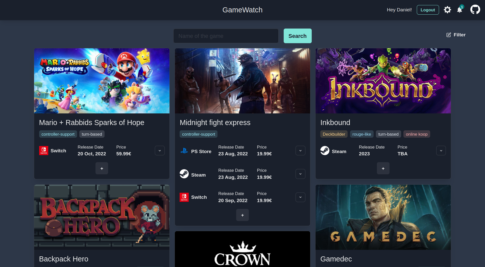

# GameWatch

Receive updates of game release dates, prices and news

## Current Features

- Nightly update of Game data
- Custom Tags
- Sources:
    - Steam
    - Epic Store
    - PS Store
    - Nintendo Store
    - ProtonDB
    - Metacritic
- (E-Mail) Notifications for
    - Price reduction
    - Release date change
    - Release of game
    - Game left Early Access
    - Addition to a store
    - Addition of Metacritic rating
    - Addition of ProtonDB rating
    - Improvement of ProtonDB rating

## FAQ

### I get crappy search results. Can't this be improved?

For now, we use the search functionality offered by the respective stores. These results are unreliable sometimes. Try to be as exact as possible with your search. There is already an issue for a possible improvement in the backlog. If you want to help, have a look at https://github.com/Agreon/game-watch/issues/248 ;).

### Why is my country not available?

The countries that are currently available were fairly easy to integrate because their store structure matched the initial countries pretty good. You are always free to add support for your country, though (https://github.com/Agreon/game-watch/issues/200). Also, you can always create an Issue and i will do my best to add it as quickly as possible.

### Why don't you crawl the stores beforehand to offer better UX?

The main idea for me - as a user of many game devices - was to get updated as soon as a game is added to a specific store (Maybe [`Dorfromantik`](https://www.nintendo.com/store/products/dorfromantik-switch/) would be nicer to play on the `Switch`?). Also, I'd often watch game release previews like the E3 and put the games that interested me in some kind of list. Now i would have to check manually for news about a release date or where they would be published. `GameWatch` takes off this work from me and maybe also from you :).

A preliminary crawl would not really have helped in these cases. Besides, the on demand crawl results are cached. So if a popular game is searched for often, the overhead won't really be noticeable.

## Contributing

You can find the Developer Documentation [here](./CONTRIBUTING.md).
